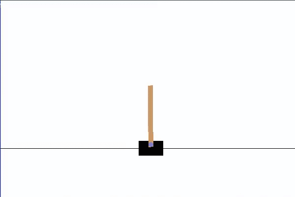

# cartpoleDQN
A Deep Q-learning neural network is used to master cartpole ([OpenAi Gym](https://gym.openai.com/envs/CartPole-v1/))

see another [DQN I made](https://github.com/JustinStitt/lunarLanderDQN) with the Lunar Lander OpenAi Gym environment

# Agent Progress Visuals

**10 Epochs of training:**

**1000 Epochs of training:**

[Deep Q-Learning](https://en.wikipedia.org/wiki/Q-learning#Deep_Q-learning) is a branch of [Reinforcement Learning](https://en.wikipedia.org/wiki/Reinforcement_learning) where Q-Values are
generated based on a discounted future reward given an action and an environment observation.

**Figure showing the feedback loop of a DQN**

As you can see, the Agent performs an action and the environment promptly delivers a discounted future reward estimate as well as the next observation.

# Learning 

**Loss**

A DQN Agent learns by minimizing loss. Loss, sometimes called cost, is determined by some criterion function. For my model, I've chosen [Mean-Squared Error](https://en.wikipedia.org/wiki/Mean_squared_error) (MSE) to calculate loss/cost.

**Gradient Descent and Optimizers**

The network minimizes this loss by using an optimizer that adjusts the networks parameters. 
A [gradient descent policy](http://www.scholarpedia.org/article/Policy_gradient_methods) is the most widely used algorithm by optimizers. 
The optimizer's goal is to find the steepest descent at any given position. Doing this for N episodes with some learning rate, you will --over time-- find some local minima.

**Local Minima and the Journey to Minimizing Loss**

In the optimizer's journey to minimizing loss, it will encounter some local minima in which in may be happy to stay in. However, we usually don't want to settle with the first local minima we find as there is
most definitely a better minima to strive towards. The best, of course, being the global minima which is the best possible position to be in as our loss is as minimal as it can possibly be.

**Learning Rate**

The learning rate will affect how the optimizer gets out of weak local minima. If the learning rate is too low, the network may get stuck in a quite poor
local minima. Moreover, if the learning rate is too high then we may entirely skip over satisfactory local minima or potentially global minima.

**Physical reconstruction I made to help myself visualize gradient descent**

Consider a 3D cartesian environment. If our network is at some (x,y) we can then run our loss criterion on Q(x,y)
which will yield some loss/cost value denoted 'z'. If you imagine dropping a ball (our network) randomly onto this physical reconstruction
and watching it roll to the deepest part of the model, then that is essentially what our network optimizer is doing.

# References

[OpenAi Gym](https://gym.openai.com/)

[DQN w/ CNN](https://medium.com/analytics-vidhya/deep-q-network-with-convolutional-neural-networks-c761697897df) -- I did not use a CNN in cartpole, but nonetheless this resource helped tremendously.

[RL Tutorial](https://www.toptal.com/deep-learning/pytorch-reinforcement-learning-tutorial)

[DQN w/ PyTorch Github Source](https://github.com/philtabor/Deep-Q-Learning-Paper-To-Code)
